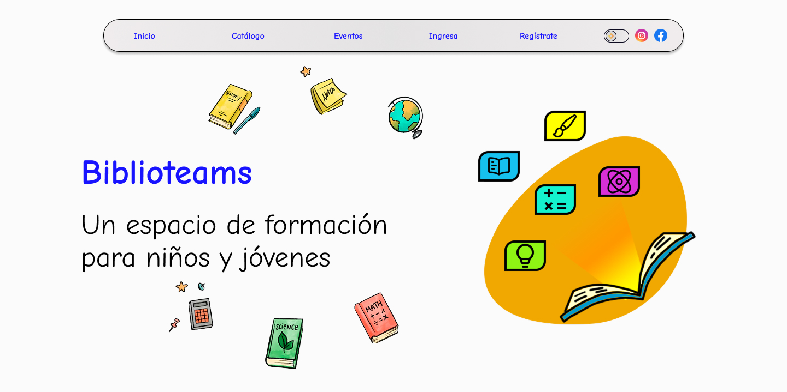

# Biblioteams

## Descripción del proyecto

- El presente proyecto consiste en una **Aplicación web que consta de un catálogo digital para una bilbioteca**
- La aplicación consta de una Landing Page + Aplicación web del catálogo + Aplicación móvil del catálogo

### Landing Page

La landing page tiene cómo objetivo la divulgación de la oferta cultural del colegio o Institución dueña de la biblioteca, entre las secciones sugeridas se encuentra,
Esta landing funcionará cómo una demo, la cual será usada para probar funcionalidades y hacer CX Research

- **Eventos** Los eventos culturales y de interés realizados por el colegio

- **Talleres** Talleres y capacitaciones organizadas extracurricularmente por la institución

- **Sección para buscar el catálogo** Sección para buscar un libro en el catálogo de la biblioteca

Las secciones padicionales serán evauladas a solicitud del cliente

### Catalogo

- El catálogo consiste en una colección de libros que puedes:

  **Cómo usuario**
  - Registrar tu perfil para hacer la devolución de los préstamos en la biblioteca
  - Pedir libros en préstamo para devolverlos de acuerdo a las políticas de la biblioteca

  **Cómo administrador**
  - Controlar el préstamos de libros de tu biblioteca
  - Obtener un historial de usuarios
  - Tener información detallada de la rotación de los libros

## Objetivos
  - Ofrecer una plataforma accesible económica para la gestión de tu biblioteca
  - Ofertar actividades culturales y programas extracurriculares que hagan las instituciones

## Público objetivo

Nuestro público objetivo son ***colegios, fundaciones, bibliotecas comunitarias*** y toda institución que posea una biblioteca y/o que cuenta con una oferta cultural para ofrecer a la comunidad (talleres, eventos, pre-icfes,etc)

## Distribución

- **Medios propios** Aplicación web, redes sociales, Aplicación móvil
- **Medios de terceros** Recomendaciones, eventos académicos

## Stack tecnológico

  El stack tecnologico consiste en

### Frontend

### Backend

### Móvil

*Nota aclaratoria*

*Cómo es un proyecto de código abierto, puedes implementar un backend con PHP,y bases de datos distintas al stack MERN. Así mismo se puede usar bases relacionales cómo MySQL*

El repositorio del backend lo puedes conseguir en el siguiente link

https://github.com/juan1988-tech/biblioteams-backend

## Documentación

**Las especificaciones técnicas de este proyecto** las puedes encontrar en**

[Ver el Sistema de diseño](/.github/documentación.md) 

## Diseño

El archivo de diseño se encuentra disponible en **Figma**

https://www.figma.com/proto/B6YkRi5vtUqmfawOytMzqh/Biblioteams?node-id=597-9655&t=nJX4E7LxBht1VBBy-1

[Ver el Sistema de diseño](/.github/sistema-de-diseño.md)

## Contacto
 - 🧑‍💻 **Nombre**  Juan david Franco
 - **Perfil de Git Hub** [juan1988-tech](https://github.com/juan1988-tech)
 - **Perfil de Linkedin** [jfranco-webdev](https://www.linkedin.com/in/jfranco-webdev/)
 - **📲 Portafolio** [Portadolio de dearrollador](https://juan1988-tech.github.io/portafolio-web/)
 - **📱 WhatsApp** (+57)3142366069
